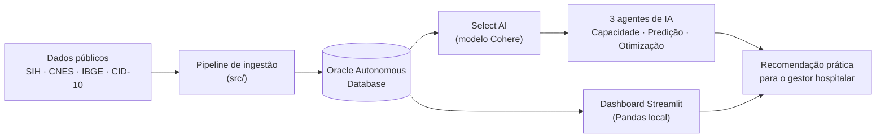

# MedData


Sistema de apoio à gestão da rede hospitalar de São Paulo, com agentes de IA sobre o Oracle Autonomous Database — desenvolvido para o **Challenge Oracle 2026**.


## O problema

A rede hospitalar de São Paulo processa centenas de milhares de internações por mês, com hospitais operando perto (ou acima) da capacidade em diversos municípios. Gestores precisam identificar rapidamente **onde está o risco de colapso**, **para onde encaminhar pacientes sem vaga** e **como a demanda deve evoluir** — decisões que hoje dependem de análise manual de planilhas e relatórios dispersos.

O MedData usa dados reais de internações (SIH/DataSUS), leitos (CNES) e municípios (IBGE) para responder essas perguntas em linguagem natural, combinando cálculos estatísticos validados com consultas geradas por IA direto no banco.

## 🔗 Acesse o dashboard

**[projeto-meddata.streamlit.app](https://projeto-meddata-3qioneoard7hqeqx9srbsn.streamlit.app/)**

## Screenshot

<!-- adicione aqui um print da tela de Monitoramento, ex.: -->
<!--  -->

## Arquitetura



## Stack

- **Python 3.12** — pipeline de dados e aplicação
- **Oracle Autonomous Database** + **Select AI** (modelo Cohere) — consultas em linguagem natural direto no banco
- **Streamlit** + **Plotly** — dashboard interativo
- **statsmodels** (ETS/Holt-Winters) — previsão de curto prazo de internações
- **LangChain + Chroma** — base de conhecimento (RAG) dos agentes de IA

## Fontes de dados

| Fonte | Conteúdo | Órgão |
|---|---|---|
| SIH (Sistema de Informações Hospitalares) | Internações, grupo RD (AIH Reduzida) | DataSUS |
| CNES | Leitos por estabelecimento | DataSUS |
| IBGE | Municípios de São Paulo | IBGE |
| CID-10 | Descrição de diagnósticos | OMS/DATASUS |

Recorte: estado de São Paulo, ~690 mil internações no período coberto pelos dados V2.

## Estrutura de pastas

```
projeto-meddata/
├── src/                     # pipeline: ingestão, transformação e carga dos dados públicos
├── dashboard_streamlit/     # aplicação Streamlit
│   ├── app.py
│   ├── pages/               # Monitoramento, Visão Geral, Pergunte aos Dados, Chat MedData
│   ├── core/                # lógica: data_loader, consultas, agentes, Select AI, RAG
│   └── README.md            # documentação técnica detalhada do dashboard
├── notebooks/                # análises exploratórias e validação do modelo de previsão
├── analise_exploratoria/     # dicionário de dados e estatísticas descritivas
└── data/                     # dados de referência (CID-10, IBGE)
```

> Documentação técnica completa do dashboard (schema dos dados, como rodar, configuração do Select AI): [`dashboard_streamlit/README.md`](dashboard_streamlit/README.md).

## Funcionalidades

| Página | O que faz |
|---|---|
| **Monitoramento** | Alertas de risco de colapso por hospital, ocupação em tempo real, tendência de internações |
| **Visão Geral** | KPIs, ranking de hospitais/municípios, diagnósticos, mapa geográfico, evolução mensal |
| **Pergunte aos Dados** | Perguntas em linguagem natural, roteadas por palavra-chave entre 3 agentes |
| **Chat MedData** | Mesmos 3 agentes, com roteamento por IA e base de conhecimento própria (RAG) |

## Os 3 agentes de IA

Cada pergunta é roteada para um agente especializado, que sempre fecha a resposta com uma **recomendação prática** para o gestor — não só o dado bruto:

- **Capacidade** — volume de internações, ocupação de leitos, ranking de hospitais.
- **Predição** — evolução das internações ao longo do tempo e tendências futuras.
- **Otimização** — comparações entre municípios/hospitais, distância, custo, eficiência.

Antes de acionar a IA, o sistema tenta reconhecer **perguntas previsíveis** (ex.: "quais hospitais estão em risco?") e responde com um cálculo já testado (Pandas/statsmodels) em vez de gerar uma consulta nova toda vez — mais rápido e imune a erros de geração de SQL. Só quando nenhum caso conhecido bate, a pergunta cai no fluxo livre: Select AI gera o SQL, executa no Oracle, e explica o resultado em português.

Detalhes de implementação (roteamento, RAG, casos conhecidos): [`dashboard_streamlit/README.md`](dashboard_streamlit/README.md).

## Como rodar localmente

```bash
py -3.12 -m venv .venv
source .venv/Scripts/activate   # Git Bash; em cmd/PowerShell: .venv\Scripts\activate
pip install -r dashboard_streamlit/requirements.txt
cd dashboard_streamlit
cp .env.example .env            # preencha as credenciais do Oracle ADB
streamlit run app.py
```

A página **Visão Geral** funciona direto (dados locais); **Pergunte aos Dados** e **Chat MedData** exigem as credenciais do Oracle no `.env`. Passo a passo completo: [`dashboard_streamlit/README.md`](dashboard_streamlit/README.md#como-rodar).

## Limitações conhecidas

- A coluna `nome_hospital` não é um nome real de estabelecimento — hospitais são sempre identificados pelo código CNES.
- `alta_complexidade` tem o mesmo valor para todos os hospitais na base (não é um critério de filtro utilizável); use `porte_hospitalar`.
- Dados de internação cobrem 2008–2024, mas ~98% do volume está concentrado nos últimos ~12 meses.
- A previsão de curto prazo é uma projeção estatística (erro médio de ~22% em teste retrospectivo), não uma garantia.

## Autoria

Isabella Batista Santos Oliveira
Projeto desenvolvido para o **Challenge Oracle 2026**.

## Licença

[MIT](LICENÇA)
